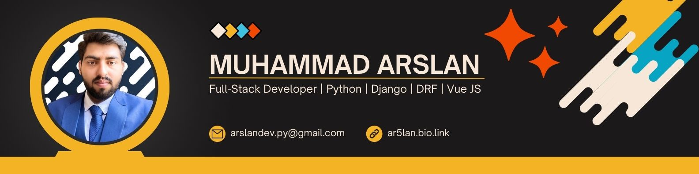

<a class="badge-base__link LI-simple-link" href="https://pk.linkedin.com/in/arslandevpy?trk=profile-badge">Muhammad Arslan</a>

              
### Hi there 👋, My name is Muhammad Arslan.
#### Python | Django Developer | React JS | Django Channels | Django Rest Framework
Python | Django Developer | React JS

    

I am a full-stack web application developer. I have a website and learning code for almost 2 years and I have experience in Website development. 

Skills: PYTHON / DJANGO / REACT JS / DATABASE ORM / PHP / Django Channels / Django Rest Framework

- 🔭 I’m currently working on <a href="https://kaptifi.com/">Kaptifi</a> 
- 🌱 I’m currently learning Solidity, DApp 
- 📫 How to reach me: arslandev.py@gmail.com 
